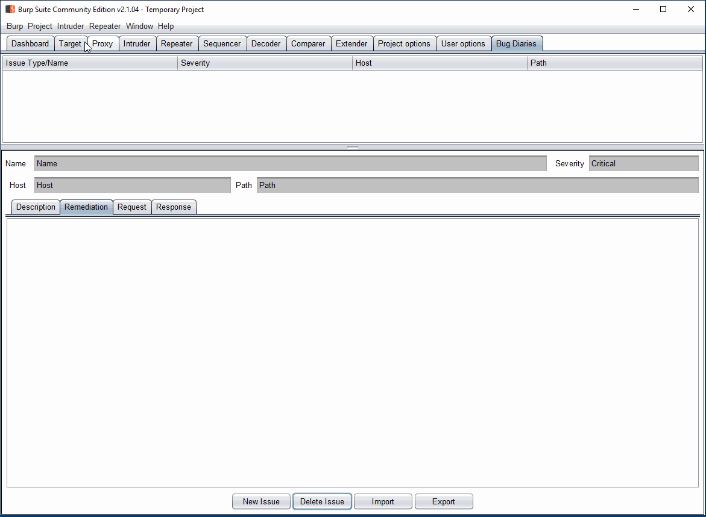
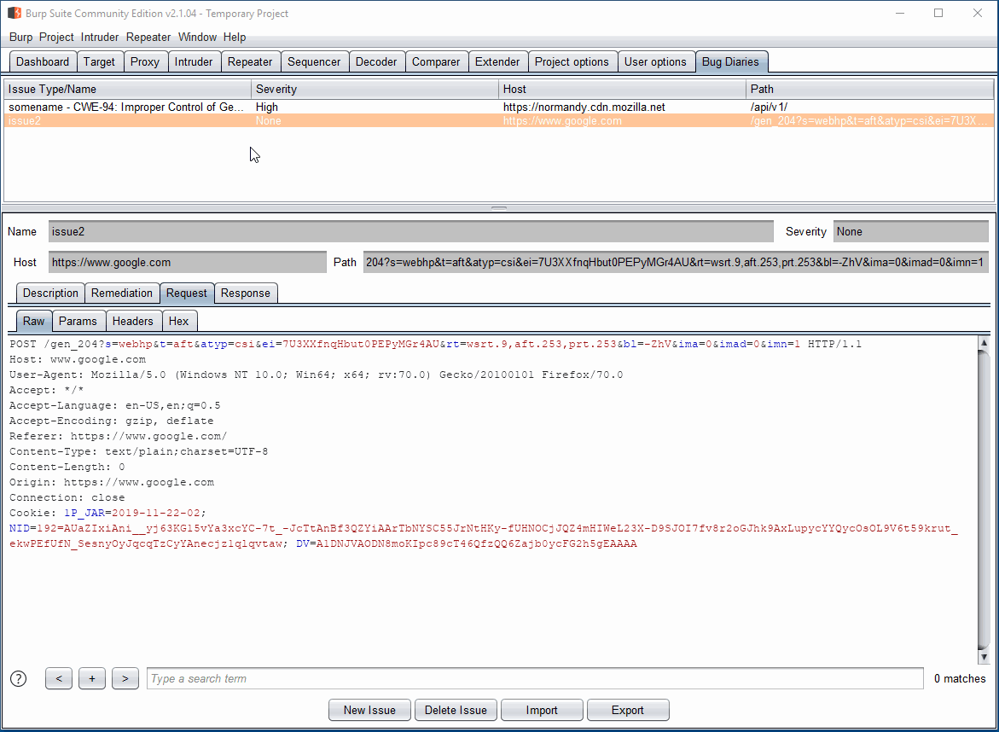

# Bug Diaries
Burp Issues for All!

Bug Diaries is a Burp extension that implements an issue tracker for the
community edition of Burp.

It is heavily under development but the master branch should be working.

## Usage
1. Setup Jython in Burp.
    * https://support.portswigger.net/customer/portal/articles/1965930-how-to-install-an-extension-in-burp-suite
2. Clone the repository.
3. Load `bug-diaries.py` in Burp.
4. Navigate to the `Bug Diaries` tab.

## Adding a New Issue

1. Right click on any request and select `Add Custom Issue`.
    * Every tab that supports context menus in Burp works. E.g., Target, Proxy,
    and Repeater.
2. A new frame pops up with the request, response, host, and path (based on the
   request), already populated.
3. Set a name for your issue.
4. Optionally, select a template. The template will overwrite description,
   remediation, and add the CWE number and name to the issue name.
    * See below on how to customize it.
5. Press `Save`.
6. The issue will be added to the `Bug Diaries` tab.

## Viewing Issues

1. In the `Bug Diaries` tab, select any issue.
2. The details will be populated in the panel.

## Editing Issues

1. Double click on any issue, in the `Bug Diaries` tab.
2. A new frame will pop-up that allows editing.
3. Edit the issue and press `Save`.
4. Modified issue will be displayed in the table.

## Exporting Issues
Bug Diaries supports exporting issues to JSON. Request and responses are
stored in base64.

1. In the `Bug Diaries` tab click `Export`.
2. Select a file in the dialog. By default, only `.json` files are displayed.
    * The extension remembers your last used directory.
    * The extension does not warn you if a file already exists.
3. Issues will be exported in JSON format to the file.

## Importing Issues
The JSON file can be imported again.

*Note: Importing will overwrite current issues.*

1. In the `Bug Diaries` tab click `Import`.
2. Select the file with exported issues.
3. Issues are not populated in the table. As mentioned above, current items in
    the table are overwritten.

# TODO
A lot. See the `Issues` tab. I am currently working on creating the context menu
for sending the requests to other Burp tabs. Unfortunately, it does not work. If
I cannot debug it, I will probably rewrite the extension in Java.

# Bugs
Please make a github issue.

# License
GPLv3. I will probably switch to MIT anyways.