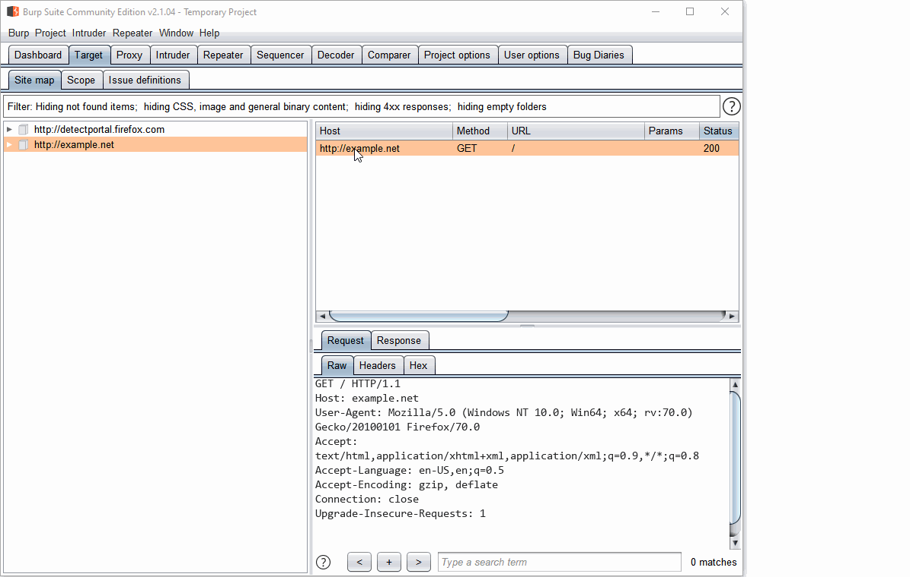
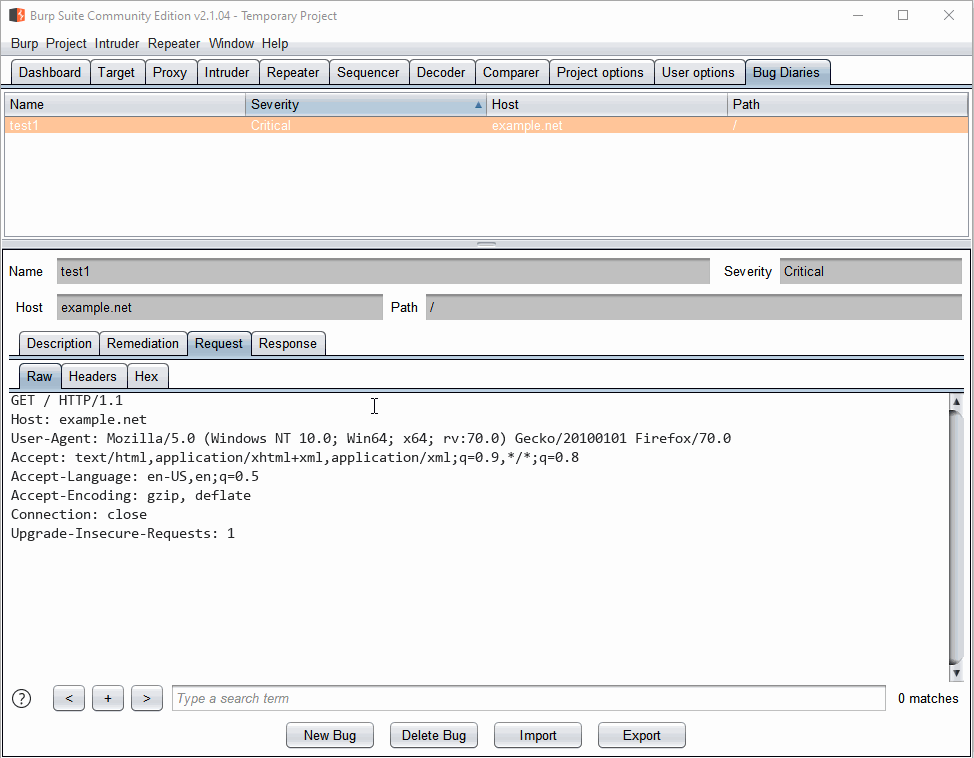
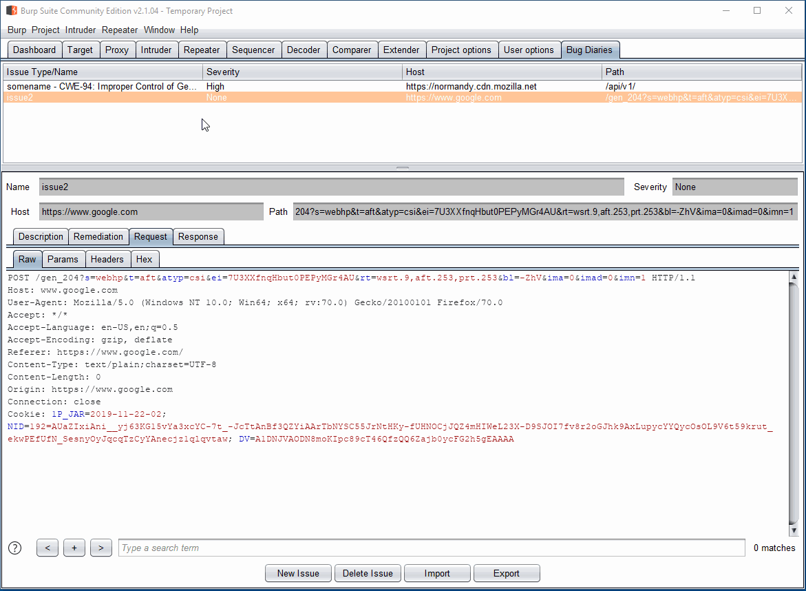
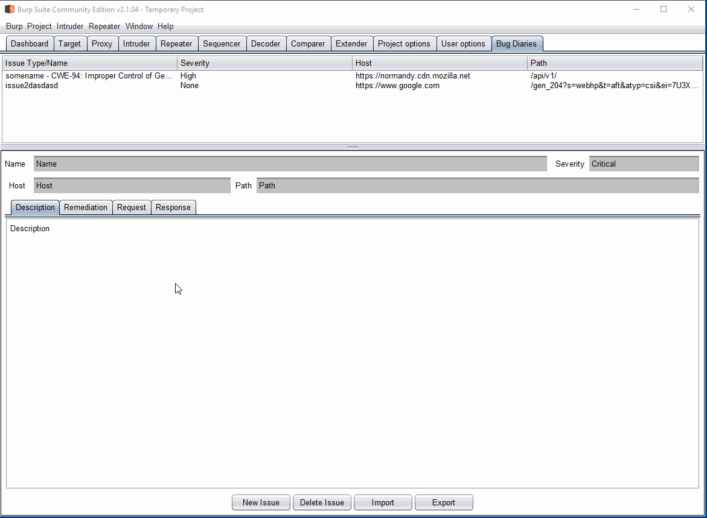

# Bug Diaries
Burp Issues for All!

Bug Diaries is a Burp extension that implements an bug tracker for the
community edition of Burp.

It's under heavy development but the `master` branch works.

Originally, the extension was written in Python. While the Python version works,
the Java version has more capabilities. See the Python version inside
[@Python](@python).

## Usage

1. Add the pre-built jar file at [release/BugDiaries-all.jar](release/BugDiaries-all.jar).

## Building The Extension

1. Clone the repository.
2. Setup Open JDK 11.
3. Setup Gradle.
    1. Use the instructions at: https://gradle.org/install/; Or
    2. Run the following command to get the binary:
        1. *nix: `./gradlew wrapper --gradle-version=6.0.1 --distribution-type=bin`
        2. Windows: `gradlew.bat wrapper --gradle-version=6.0.1 --distribution-type=bin`
4. Run `gradle bigjar`
5. The newly built jar file will be at [release/BugDiaries-all.jar](release/BugDiaries-all.jar).
6. Optionally, open the directory in Visual Studio Code and use `Ctrl+Shift+B`.

For more information about my development process (and debugging Burp
extensions), please see the following blog post:

* https://parsiya.net/blog/2019-12-02-developing-and-debugging-java-burp-extensions-with-visual-studio-code/

# Capabilities

## Adding a New Bug

1. Right click on any request and select `Make Custom Bug`.
    * Every tab that supports context menus in Burp works. E.g., Target, Proxy,
    and Repeater.
2. A new frame pops up with the request, response, host, and path (based on the
   request), already populated.
3. Set a name for your bug.
4. Optionally, select a template. The template will overwrite description,
   remediation, and add the CWE number and name to the bug name.
    * See below on how to customize it.
5. Press `Save`.
6. The bug will be added to the `Bug Diaries` tab.

## Viewing Bugs

1. In the `Bug Diaries` tab, select any bug.
2. The details will be populated in the panel.

## Sending Requests to Other Burp tabs

1. Right click on the request or response message editor for any bug in the
   main tab.
2. Send the request or response to any other Burp tab such as Repeater,
   Comparer, or Intruder.

## Editing Bugs

1. Double click on any bug, in the `Bug Diaries` tab.
2. A new frame will pop-up that allows editing.
3. Edit the bug and press `Save`.
4. Modified bug will be displayed in the table.

## Exporting Bugs
Bug Diaries supports exporting bugs to JSON.

1. In the `Bug Diaries` tab click `Export`.
2. Select a file in the dialog. By default, only `.json` files are displayed.
    * The extension remembers your last used directory.
    * The extension does not warn you if a file already exists.
3. Bugs will be exported in JSON format to the file.

## Importing Bugs
The JSON file can be imported again.

*Note: Importing will overwrite current bugs.*

1. In the `Bug Diaries` tab click `Import`.
2. Select the file with exported bugs.
3. Bugs are not populated in the table. As mentioned above, current items in
    the table are overwritten.

# TODO
A lot. See Github issues for som planned features.

1. Create an HTML report similar to Burp from the bugs in the extension.
2. Convert a Burp Scan item to a bug in the extension and vice versa.
    1. Only the pro version of Burp has the this feature.

# Bugs
Please make a Github issue.

# License
GPLv3, see [LICENSE](LICENSE) for details